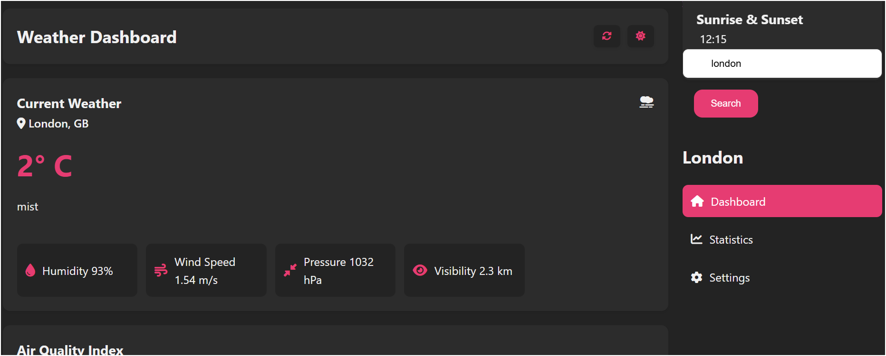

# Weatherstar - Modern Weather Dashboard

## 🌤️ Overview

Weatherstar is a modern, responsive weather dashboard that provides real-time weather information and forecasts. Built with vanilla JavaScript and Chart.js, it offers a clean, intuitive interface for accessing weather data.

## ✨ Features

- **Real-time Weather Data**: Current weather conditions including temperature, humidity, wind speed, and more
- **5-Day Forecast**: Detailed weather predictions for the next five days
- **Temperature Trends**: 24-hour temperature forecast visualization
- **Air Quality Index**: Real-time AQI monitoring with visual indicators
- **Responsive Design**: Seamless experience across all devices

## 🚀 Getting Started

### Prerequisites

- OpenWeather API Key ([Get it here](https://openweathermap.org/api))
- Modern web browser
- Basic understanding of HTML, CSS, and JavaScript

- ## 🛠️ Technology Stack

- HTML5
- CSS3
- Vanilla JavaScript
- Chart.js for data visualization
- OpenWeather API
- Font Awesome icons
- Google Fonts (Space Grotesk)

  
  
    

  

## 📱 Browser Support

- Chrome (latest)
- Firefox (latest)
- Safari (latest)
- Edge (latest)

## 👏 Acknowledgments

- Weather data provided by [OpenWeather](https://openweathermap.org/)
- Icons by [Font Awesome](https://fontawesome.com/)
- Fonts by [Google Fonts](https://fonts.google.com/)

Project Link: [Weatherstar](https://github.com/SGcpu/weatherstar) 
MADE WITH ❤️ by [SGcpu](https://github.com/SGcpu)

